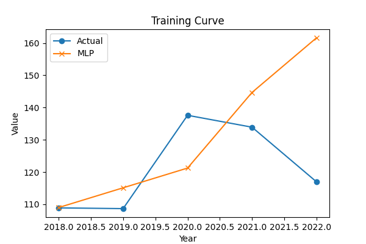
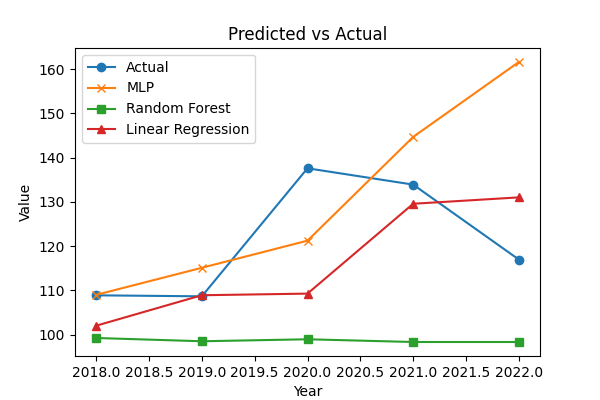

<<<<<<< HEAD
# WK-2-ASSIGNMENT-AI-FOR-SOFTWARE-ENGINEERING
=======

# AI for SDG 2: Forecasting Project

## Project Overview
This project predicts agricultural metrics for policymakers and smallholders to support SDG 2 (Zero Hunger). We use time-series regression with lag features.

## Approach
- Model: Multi-Layer Perceptron (MLP)
- Baselines: Random Forest, Linear Regression
- Tools: Python, TensorFlow/Keras, scikit-learn
- Country: Kenya

## Evaluation Metrics
| Model          | MAE   | RMSE  | R²    |
|----------------|-------|-------|-------|
| MLP            | 15.67 | 22.0 | -2.2 |
| Random Forest  | 22.53 | 25.7 | -3.36 |
| Linear Regression | 10.76 | 14.6 | -0.41 |

## Outputs
- Training Curve: 
- Predicted vs Actual: 
- Test Predictions: outputs/test_predictions_Kenya.csv

## Usage
1. Run the scripts in order in `code/`.
2. Update the country variable as needed.
3. Check outputs in the 'outputs' folder.
>>>>>>> faaabf0 (Initial commit: code, outputs, README)
